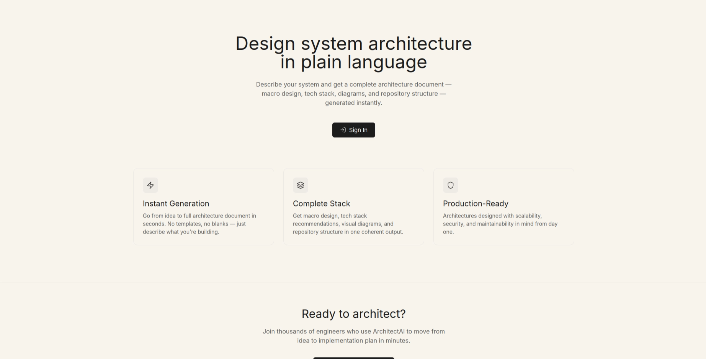
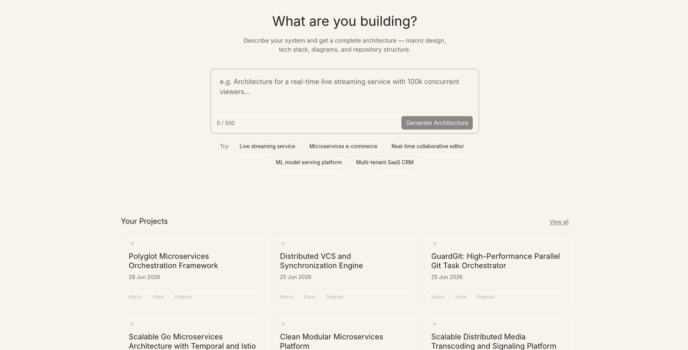
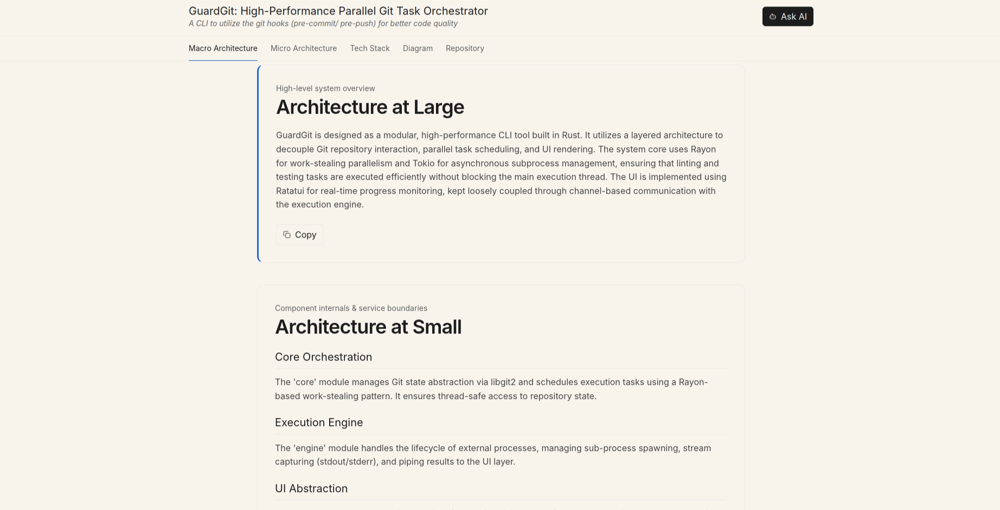
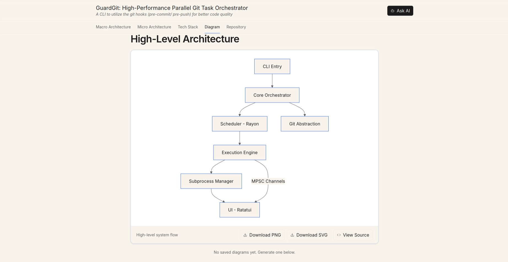
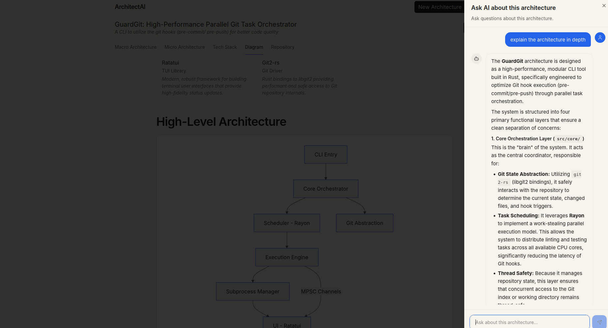

# AI Assisted Software Architecture Generator

## Project Overview

ArchiGen allows user to generate Software Architecture (Both at large and at small), proposed tech stack, code repository structure and specific architectural diagrams (Use Case, Sequence, ER, Class, Flow chart and State) just by providing the requirements. It uses Agentic AI to generate this architecture components. It also provides the functionality to use a built-in  AI chatbot to discuss further on the generated architecture.

## Requirements

This project was a university assignment project with the requirement of `“Using the available AI tools, build a software engineering workbench where software design automation can be explored. From high-level user requirements, the tool will be able to design and suggest a solution architecture with reasons for such a decision”` .

## Prototype

The initial version of the tool was implemented as a single `HTML`  file, that calls `Gemini LLM`  to generate the architecture in a single API call. The detailed description of the prototype can be accessed [in this drive link](https://drive.google.com/file/d/1Hqjr2_Icd6FBf7QcFYN_R0U0yfCaJevK/view?usp=sharing). (Note: the access link for the tool provided in the document might not be accessible in the future).  

## Implemented Solution (Version 1)

ArchiGen acts as the Minimum Viable Product (MVP) for the current requirement, with the following features:

- AI-assisted Software Architecture (Design) generation from user requirements.
- Generation of Architectural Diagrams.
- AI chatbot to discuss justifications and tradeoffs.
- Authentication and storing the generated architecture as a project.

### Architecture

The system at large follows a microservices architecture, comprised of respective services for AI related functions and Project related functions, Identity Access Management is handled by WSO2 Identity Platform (formerly Asgardeo).

![[Architecture]-High-level.png](assets/img/archigen/Architecture-High-level.png)

For Agentic workflow (Architecture Generation) Google Agent Development Kit (`google-adk`) was used due it’s ability to define AI agents as code resulting in short development time.  

The following describes core architectural decisions and their rationales:

#### API Gateway Pattern

- **Decision:** Introduce a centralized FastAPI Gateway rather than exposing the Project and Agent services directly to the frontend.
- **Justification:** The gateway acts as a single entry point for the frontend, abstracting the internal microservice topology. This prevents the frontend from needing to know the IPs or ports of individual services. FastAPI was chosen for this role because its asynchronous nature (via ASGI) makes it highly performant for I/O-bound proxying operations.

#### Microservice Boundary Separation: Core vs. AI Workloads

- **Decision:** Splitting the backend into a `project_service` (for CRUD operations) and an `agent_service` (for LLM orchestration) rather than a single monolithic backend.
- **Justification:** This separates **deterministic** workloads from **non-deterministic** workloads. Generating an architecture via Gemini might take 10–30 seconds. By isolating the AI processing into its own service, long-running AI requests do not block the event loop or consume resources needed by the `project_service`, ensuring the UI remains snappy when users are just browsing their saved projects.

#### Authentication Offloading (Gateway + WSO2 Asgardeo)

- **Decision:** The API Gateway intercepts requests, validates the JWT against WSO2 Asgardeo's JWKS endpoint, and injects an `X-User-Id` header before routing to downstream services.
- **Justification:** This strictly decouples identity management from business logic. Downstream services (Project and Agent) do not need cryptographic libraries, internet access to the IdP, or token validation logic. They simply trust the `X-User-Id` header, which is safe because the gateway and services communicate exclusively over the isolated internal network where external clients cannot spoof headers.

![[Sequene]-API-request-flow.png](assets/img/archigen/Sequene-API-request-flow.png)

#### Multi-Agent AI Pipeline (Google ADK)

- **Decision:** Utilize Google's Agent Development Kit (ADK) to create a Directed Cyclic Graph workflow (Generator Agents + Validator Agents) instead of a single LLM prompt.
- **Justification:** Generative AI is prone to hallucinations and inconsistent formatting. By forcing the output through a self-correcting loop (e.g., `ArchitectureAtLargeValidator` rejecting and re-prompting the `ArchitectureGenerator`), the system ensures structural integrity and technical feasibility before moving to the next phase. The final `JSONPackager` agent ensures the unstructured LLM text is forced into a strict, deterministic schema that the frontend can safely parse.

#### AI Workflow: Validation-in-the-Loop (Cyclic Graphs)

- **Decision:** Designing the ADK workflow as a Directed Cyclic Graph (where the Validator can route back to the Generator on failure) instead of a simple linear chain.
- **Justification:** Zero-shot generation for complex software architectures is risky. The cyclic validation loop acts as an automated "unit test" for the AI. It forces the system to self-reflect and fix security, scalability, or architectural flaws *before* the data moves to the next phase, resulting in a much higher quality final output.

#### AI Pipeline: The Dedicated JSON Packager Agent

- **Decision:** Creating a specialized `JSONPackager` agent at the end of the ADK workflow, rather than asking the primary `ArchitectureGenerator` to output JSON directly.
- **Justification:** Large Language Models suffer from "attention degradation" when asked to be highly creative (designing a complex system) and highly structural (formatting strict JSON) at the same time. By separating the *creative generation* phase from the *data formatting* phase, you dramatically reduce JSON syntax errors, hallucinations, and missing keys.

![[Flow]-Architecture-Generation.png](assets/img/archigen/Flow-Architecture-Generation.png)

#### Dual-Database Strategy: PostgreSQL & Redis

- **Decision:** Use PostgreSQL for project/user state and Redis for agent session memory.
- **Justification:**
  - **PostgreSQL:** Provides ACID compliance and relational integrity, which is mandatory for storing generated architectures, user metadata, and project configurations.
    - **Redis:** Generative AI agents require the entire conversation history injected into their context window on every turn. Redis provides the sub-millisecond read/write speeds necessary to fetch and update this in-memory session state without creating bottlenecks in the AI pipeline.

### Deployment Strategy

#### 1. Local Development Strategy: The "Inner Loop"

**Tooling:** `docker-compose` (via `docker-compose.yml`)
**Primary Goal:** Maximum iteration speed and seamless developer experience.

The local strategy optimizes for immediate feedback. When a developer changes a line of code, they need to see that change instantly without waiting for container rebuilds.

- **Live Code Mounting (Bind Mounts):** Instead of copying the code into the container, the local configuration uses bind mounts (e.g., `./app:/code/app`). This links the host machine's directory directly into the container.
- **Hot-Reloading:** Because the code is bind-mounted, the FastAPI servers run with `-reload` and the React frontend uses the Vite dev server. Any saved file instantly triggers a hot-reload inside the running containers.
- **On-the-Fly Builds:** The compose file uses `build: .` directives. Developers don't need to push or pull images from a registry; Docker builds the development images directly from the local source code.
- **Automatic Environment Parsing:** Docker Compose natively reads the `.env` file in the same directory, making configuration injection seamless for the developer.
- **Networking:** Uses a standard local bridge network. Containers talk to each other via DNS names (e.g., `http://project_db:5432`), but they are all physically running on a single host daemon.

![[Deployment]-local.png](assets/img/archigen/Deployment-local.png)

#### 2. Prod-Simulation Strategy: Swarm Orchestration

**Tooling:** Docker Swarm (via `docker stack deploy -c docker-compose.prod.yml`)
**Primary Goal:** Reliability, self-healing, scaling, and deployment parity.

The Swarm strategy treats your local machine as if it were a multi-node production cluster. It strips away development conveniences in favor of architectural rigor, ensuring that when the code goes to a real cloud environment, there are no surprises.

- **Immutable Image Artifacts:** Swarm does not build from source. It relies on pre-built, versioned images (e.g., `pratheepsri/archigen-agent:0.0.1`) pulled from a container registry (Docker Hub). This guarantees that the exact code tested is the code deployed.
- **Stateless Frontend Delivery:** The Vite dev server is replaced by a multi-stage Docker build that compiles the React app into static files and serves them via a highly optimized Nginx web server.
- **Placement Constraints & Scheduling:** Using the `deploy` block, services are pinned to specific node types (e.g., `node.role == manager` or `node.labels.type == ai-worker`). This simulates how workloads (like heavy AI processing) would be routed to specialized GPU/high-compute nodes in a real cloud.
- **Self-Healing & Replicas:** Swarm actively monitors container health. If the `agent_service` crashes (e.g., exiting with code 1), Swarm automatically schedules a new task to replace it to maintain the desired replica count.
- **Distributed Networking:** Uses an `overlay` network (`archigen_overlay`). Even if the API Gateway and the Agent Service were running on physically different servers, Swarm's ingress routing mesh allows them to communicate securely as if they were on a local LAN.
- **Explicit Environment Injection:** Swarm ignores local `.env` files by design for security. Environment variables must be explicitly exported to the shell and injected at deploy time via the `deploy.sh` script, mimicking how CI/CD pipelines inject secrets into production clusters.

### Screenshots

  
