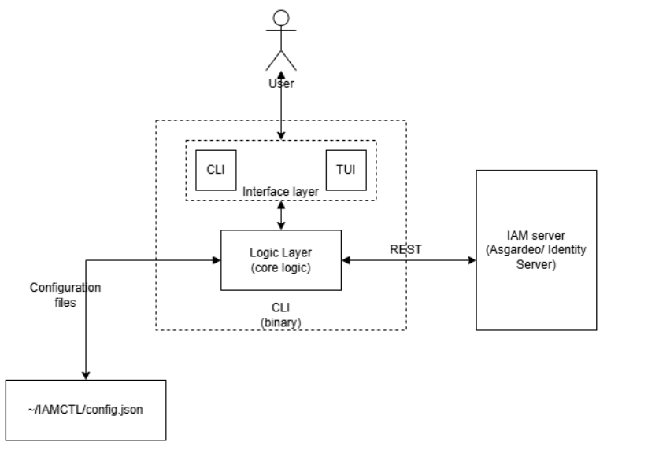
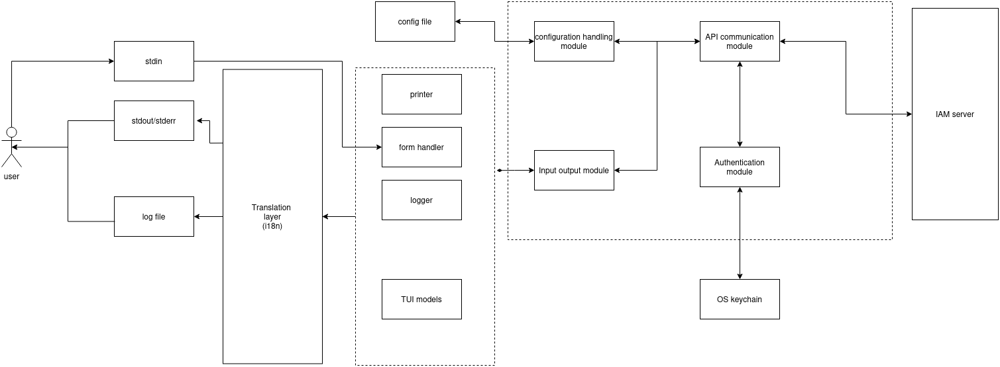
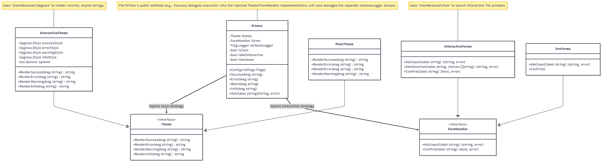

# Asgardeo CLI Tool

## Project Overview

[Asgardeo](https://wso2.com/asgardeo/) CLI (Command Line Interface) tool allows you to access Identity Access Management resources in Asgardeo and (Identity Server) from the the terminal using commands and keyboard operations via the Text User Interface (TUI) operations.

## Problem Statement

To maintain IAM resources like applications. API resources. users, roles, groups, etc, the user has to access the Asgardeo console webpage or manually construct the `curl` command to access the Management REST API endpoints.This introduces additional concerns as maintaining authentication, securely storing tokens and client secrets, and OS specific commands, Additionally most of the users of Asgardeo are developers who spend most of their time in terminal and IDEs, hence it is desired to provide a way to manage the Asgardeo configurations via the terminal. Apart from these technical requirements, almost all of other competitors provide CLI functionalities to their IAM servers, Ex: [Auth0 CLI](https://auth0.com/docs/deploy-monitor/auth0-cli) , [AWS IAM CLI](https://www.google.com/url?sa=t&source=web&rct=j&opi=89978449&url=https://docs.aws.amazon.com/cli/latest/reference/iam/&ved=2ahUKEwj37qqV6MKUAxUNoWMGHciOCHsQFnoECB4QAQ&usg=AOvVaw12kFQf7lOmUx-1gOq569Wj)

## Requirements

- Build a modular CLI framework with authentication, profiles, and help commands.
- Manage applications and connections (create, update, delete, list).
- Handle users, groups, and roles.
- Enable JSON/YAML outputs for scripting and CI/CD automation.
- Provide interactive and non-interactive modes with auto completion and prompts.
- Provide a Text User Interface (TUI) for more interactive user experience

## Architecture

The tool is expected to provide two different interfaces to the users, the CLI where users perform the functionalities via commands (`asg apps list`) and the TUI where users perform the actions by keyboard movements and shortcuts (`ctrl+n`). Even though two different interfaces are provided the core logic is the same. So a layered architecture is followed decoupling the logic from the interfaces.

The tool is expected to be distributed as a single binary containing both the CLI and TUI features. At high level the binary will act as a wrapper for Asgardeo REST API endpoints, handling authentication, configuration and error handling.

The logic layer communicates with the Identity Access Management (IAM) server (Asgardeo or identity Server) via REST API calls via the provided endpoints. The configuration for the tool is provided from configuration files (JSON, YAML) and the secrets (client secret and token) will be stored securely (OS keychain). _The architecture proposes a global configuration (single config file in a home directory) instead of local config file (creating multiple config files in each working directory)._

### Internal System Layers

To enforce separation of concerns and ensure maintainability, the application is split into four distinct structural layers:

- **Presentation (UI) Layer:** This is the entry point of the binary, responsible for argument parsing, user interaction, and output formatting. It contains two isolated packages: the **CLI module** (powered by Cobra) for processing declarative commands, flags, and sub commands, and the **TUI module** (powered by Bubble Tea and Huh) for rendering interactive terminal views, handling keyboard shortcuts, and capturing form inputs.
- **Core Logic Layer:** This layer serves as the system's brain, completely decoupled from _how_ the user invoked the command. It validates inputs passed down from the UI layer, enforces business rules, manages the execution workflow, and marshals internal data models into standard formats (Text, JSON, or YAML) before passing them back up to the UI layer for rendering.
  - **API Client Layer:** A dedicated network client responsible for executing HTTP/REST communications with the Asgardeo Server. It encapsulates the complexities of endpoints, maps payload schemas to native Go structs, handles network timeouts, translates HTTP error status codes into human-readable domain errors, and manages token injection for authorized requests.
  - **Storage & Configuration Layer:** This layer handles the persistence of state across CLI invocations. It interfaces with the local file system via Viper to read/write global settings (such as the target organization or tenant URL) and securely talks to the host operating system's native keyring (via Go Keyring) to manage sensitive assets like client credentials and access tokens.

### Interface Orchestration: Cobra & Bubble Tea Interaction

The root execution loop always begins within the Cobra framework. When a user runs a command, Cobra handles the initial command routing, flag parsing, and global configuration loading. The interaction between the two interfaces then follows one of two code paths based on the context of the execution:

1. **Non-Interactive (CLI-First) Mode:** For direct commands like `asg apps list --format json`, Cobra executes the targeted sub command block. It invokes the Core Logic layer directly, retrieves the data from the API Client layer, formats the raw Go structs into the requested schema, prints the result to standard output (`stdout`), and immediately terminates the process with a zero exit code.
2. **Interactive (TUI-First) Mode:** If the user executes the base interactive command (e.g., `asg tui` without arguments), Cobra acts as a launcher. It initializes the Bubble Tea event loop, giving it full control over the terminal's standard input and output streams. The Bubble Tea model-view architecture then drives the lifecycle of the terminal application. When an action is taken inside the TUI (such as scrolling through a list of applications and pressing `Enter`), the Bubble Tea update loop triggers a message that invokes the shared Core Logic layer, updating the UI state cleanly without colliding with the outer Cobra scope.

### TUI model Architecture

Bubble Tea is based on the [Elm architecture](https://app.notion.com/p/Asgardeo-CLI-Tool-36484eb87f9980549ec1e056061bcc7c?pvs=21). It does not use a traditional MVC (Model-View-Controller) pattern; instead, it uses the **Model-View-Update (MVU)** pattern.

When building a complex CLI like the Asgardeo tool, putting all logic in one model creates a massive, unmaintainable file. Instead, you use **Model Composition**, where a Root Model acts as a router for sub-models.

#### 1. The Root Model (The Router)

The `RootModel` holds the global state (like configuration, session tokens, and the currently active sub-view). It acts as the traffic cop for the application.

- **State Tracking:** It keeps a property like `activeView` (an enum mapping to `Home`, `AppList`, `UserList`).
- **Holding Sub-Models:** It stores instances of the sub-models (e.g., `appModel`, `userModel`) as fields within its own struct.

#### 2. Delegating `Update()`

When the Bubble Tea runtime event loop detects an event (a keystroke, a window resize, or an HTTP response), it packages it into a `tea.Msg` and sends it to the Root's `Update(msg)` function.

1. **Global Overrides:** The Root first checks for global messages (like `Ctrl+C` to quit, or `Tab` to switch views).
2. **Routing:** If the message isn't global, the Root checks its `activeView`. If the user is currently managing applications, the Root calls `appModel.Update(msg)`.
3. **Capturing State:** Because Go is pass-by-value, the `appModel.Update()` returns a _new_ copy of the `appModel`. The Root model overwrites its own `appModel` field with this new copy.
4. **Bubbling Commands:** If the `appModel` returns a `tea.Cmd` (like "fetch more data"), the Root returns that command up to the Bubble Tea runtime to execute asynchronously.

#### 3. Delegating `View()`

The Bubble Tea runtime calls `RootModel.View()` to figure out what to draw on the screen.
The Root model doesn't draw the application list itself. Instead, it calls `appModel.View()`, takes the resulting string, and typically wraps it in global UI components.

For example, the Root might render a global navigation bar at the top, inject the string returned by `appModel.View()` in the middle, and add global keyboard shortcuts at the bottom.

### CLI Architecture

The CLI uses the [Cobra](https://cobra.dev/) library to provide command-based execution. Cobra provides command-tree based dispatch: each command registers its arguments, flags, validation rules, and execution handler. When a user types `asg apps list`, Cobra traverses the command tree (`asg` → `apps` → `list`), validates the provided flags, and invokes the corresponding handler function. This routing mechanism allows the command hierarchy to map user input directly to the appropriate core operation without the presentation layer needing to know about the underlying business logic.

### Printer Abstraction

In the tool the output should be printed in different formats (Colored, non colored, JSON/YAML) and should support verbose mode. Handling these configurations each and every time when the tool needs to output something is redundant, so a shared printer abstraction is used to centralize output formatting.

> **Note:** This is a draft class diagram to define the structure, concrete implementation may differ.

The printer is initialized on command startup based on user preferences for verbosity and interactivity. The current implementation uses a shared instance for simplicity. A more robust approach would define a `Printer` interface and inject it into each command context, which would improve testability (allowing output capture in tests), make output redirection easier, and keep the CLI/TUI separation cleaner. This is a recognized trade-off: the shared instance is an MVP convenience, not an ideal long-term pattern.

## Authentication Flow

The tool will provide two different methodologies to authenticate.

1. Login via Asgardeo Account and use the account’s (user’s) privileges - (uses Device code authorization flow)
2. Login via an application and use the applications privileges (uses client credentials m2m authentication flow)

### Login via Asgardeo account

This implementation needs some internal changes to Asgardeo to enable users to login with their Asgardeo account.

### Login via an application

## Tech Stack

### Language Selection

The following decision matrix summarizes how each candidate language meets the core requirements for a CLI/TUI tool:

| Requirement | Python | Java | Rust | Go |
| ------------------- | ------ | ---- | ---- | --- |
| Single binary | △ | △ | ✓ | ✓ |
| Startup time | △ | ✗ | ✓ | ✓ |
| TUI ecosystem | ✓ | △ | ✓ | ✓ |
| Development speed | ✓ | △ | △ | ✓ |
| Cross compilation | △ | ✓ | ✓ | ✓ |
| Concurrency | ✓ | ✓ | ✓ | ✓ |

> ✓ = strong fit, △ = possible with caveats, ✗ = poor fit_

**Go** was selected because it uniquely satisfies all six requirements without significant trade-offs. Python's distribution story (virtual environments, PyInstaller bundles) makes it impractical for a tool intended for general distribution. Java's JVM startup latency is unacceptable for CLI workflows where commands are chained via pipes. Rust meets the technical requirements but its steeper learning curve would have significantly slowed development velocity for this project's scope.

Go compiles to a single statically linked binary with no runtime dependencies, starts instantly, cross-compiles trivially (`GOOS=windows go build`), and has the **Charmbracelet** ecosystem (Bubble Tea, Lip Gloss, Bubbles) which is the most mature and polished TUI framework available for any language.

The tool is decided to be built with the [Go Programming Language](https://go.dev/ref/spec). Additional to native Go libraries, following external libraries will be used,

| Dependency | Purpose | License |
| --------------------------------------------------- | --------------------------------------------------------------------------- | ------------------ |
| [Cobra](https://cobra.dev/docs/) (v 1.10.2) | Main command execution workflow, providing commands, sub commands and flags | Apache License 2.0 |
| [Viper](https://github.com/spf13/viper) | Configuration management | MIT License |
| [Go keyring](https://github.com/zalando/go-keyring) | Secrets storage | MIT License |
| [Bubble Tea](https://github.com/charmbracelet/bubbletea) | TUI event loop handling | MIT License |
| [Huh](https://github.com/charmbracelet/huh) | Stylized inputs | MIT License |
| [Lip gloss](https://github.com/charmbracelet/lipgloss) | UI styling | MIT License |
| [log](https://github.com/charmbracelet/log) | Logging | MIT License |
| [Glamour](https://github.com/charmbracelet/glamour) | Markdown rendering | MIT License |
| [i18n](https://github.com/nicksnyder/go-i18n) | Localization | MIT License |

## Tradeoffs

### Security vs User Experience

To execute any operation it is needed to send an authenticated REST API request to the server with an access token. This can be implemented in two different ways.

#### 1. Principle of least privileges

Each access token has associated scopes to perform certain actions in the server (`internal_app_mgt_delete`). To avoid the attack radius in case of token leakage, it is preferred to fetch the token specifically with only the required scope for the current operation before executing the operation using the credentials.

But it reduces the performance of the CLI to send an additional request before each request affecting the performance and increasing the probability of command failure.

It is possible in Machine authentication flow using the Client credentials but without modifications in the server the user may need to login with their credentials for each command making the tool unusable.

#### 2. Store and reuse the token

Once the user authenticates via `login` command the tool will request for all the available scopes and store the fetched token in the OS keyring. The OS keyring provides platform-managed credential storage, which avoids writing raw secrets into ordinary configuration files and leverages the operating system's native security mechanisms. However, it does not protect against a fully compromised user account or host — if an attacker has local access under the user's session, keyring contents may be accessible. The keyring reduces exposure surface but is not a guarantee of absolute token security.

But there is a limit for the length of values stored in the keyring for different OS which may make this implementation fail if JWT tokens are used since they are self contained, to mitigate this it is recommended to use opaque tokens, since their limit does not vary based on the number of scopes requested in the token.

### Interactivity vs User Experience

Making the input forms more interactive introduces complications in showing the state of the commands (Ex: previously entered values) and showing the values entered by user in previous steps reduces the interactivity of the tool by hiding the placeholder values and constraining the `select` or `confirm` type inputs.

Since more interactivity is provided in TUI mode it is decided to preserve the state-fullness of each command by showing previous inputs throughout the command lifecycle.

## Challenges

### **Handling Race Conditions in Nested Forms**

A common challenge when building interactive TUIs is handling **nested forms** — situations where a smaller, focused input form is presented on top of a larger, still-active parent form.

The problem arises because both forms run in separate goroutines, and both listen for the same keystroke events simultaneously. When a user types, there is no guarantee which goroutine receives the input first. If the background form grabs the keystroke before the active form does, the input is silently consumed and processed somewhere the user never intended — and since the background form has no control over `stdout`, it cannot update the UI to reflect what happened. From the user's perspective, keystrokes just randomly disappear.

This is a classic race condition: two concurrent processes competing for the same resource (keyboard input) with no coordination between them.

**The fix is straightforward in principle: nested forms should never run concurrently.** When a child form becomes active, the parent form must stop listening for events entirely. Only one form should own the input stream at any given time. When the child form completes or is dismissed, ownership is handed back to the parent.

In practice, this means treating form activation as a explicit state transition in the Model rather than simply spawning a new goroutine. The active form is a value in the state, and the Update function routes incoming messages _only_ to whichever form is currently marked active.

## Failure Behavior

The following documents expected failure scenarios, how they are detected, and the user-visible result:

| Failure | Detection | Recovery | User-visible Result |
| ----------------------- | --------------- | ---------------------- | ------------------------------------ |
| Token expired | HTTP 401 | Automatic refresh or re-auth prompt | Login prompt or transparent retry |
| API unavailable | Network error / timeout | Retry with backoff | Actionable error message with retry suggestion |
| Keyring unavailable | Storage error | Fallback to error | Error explaining keyring setup |
| API rate limit (429) | HTTP 429 | Backoff and retry | Retry message with wait time |
| Invalid credentials | HTTP 401/403 | Prompt re-login | Clear error directing user to `asg login` |
| Malformed API response | JSON parse error | Abort with error | Error with raw status for debugging |
| TUI unexpected message | Type assertion failure | Ignore unknown message | No visible effect (graceful degradation) |

## Screenshots

## Future Improvements

### AI agent skills

Even though the tool is intended to be used by human users the `non-interactive` CLI mode of this tool can be used by AI agents (Tools like Claude, Codex). In the later period of the project efforts were done to develop a skill for agents to use the CLI and perform actions behalf of the users and incrementally create an `init` command to perform initial configuration based on the user’s requirement.
